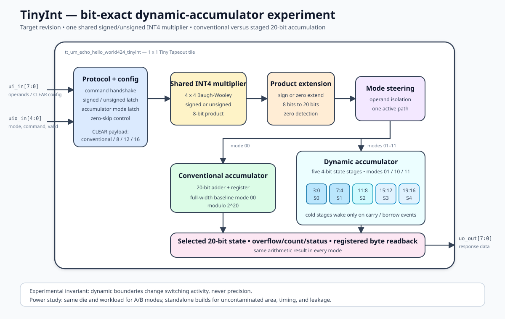
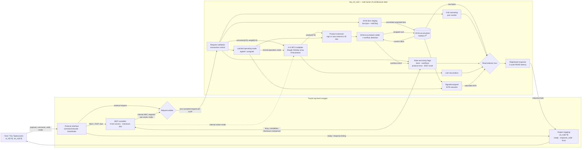

   

# TinyInt

TinyInt currently implements the multiplier baseline for a streaming INT4
dot-product peripheral. Its original combinational 4-bit by 4-bit multiplier
supports unsigned multiplication and signed two's-complement multiplication
using a shared Baugh-Wooley partial-product array.

- `ui_in[3:0]`: weight/multiplicand
- `ui_in[7:4]`: activation/multiplier
- `uio_in[4]`: requested mode (`0` unsigned, `1` signed)
- `uio_in[3:1]`: command; `001` is `CLEAR`
- `uio_in[0]`: command valid
- `uo_out[7:0]`: current baseline multiplier product

The operating mode resets to unsigned and is sampled from `uio_in[4]` only
when a valid `CLEAR` request is accepted. Changing the live mode pin during a
transaction cannot change multiplier arithmetic. The source is split into a
standalone multiplier leaf, a state-owning core, and a Tiny Tapeout protocol
adapter in preparation for the accumulator and BIST stages.

Run every Cocotb module test from the repository root with `make test=ALL`, or
run only the multiplier tests with `make test=int4_multiplier`. Use `make clean`
to remove all generated test artifacts.

- [Read the documentation for project](docs/info.md)

## Architecture

## What is Tiny Tapeout?

Tiny Tapeout is an educational project that aims to make it easier and cheaper than ever to get your digital and analog designs manufactured on a real chip.

To learn more and get started, visit https://tinytapeout.com.

## Set up your Verilog project

1. Add your Verilog files to the `src` folder.
2. Edit the [info.yaml](info.yaml) and update information about your project, paying special attention to the `source_files` and `top_module` properties. If you are upgrading an existing Tiny Tapeout project, check out our [online info.yaml migration tool](https://tinytapeout.github.io/tt-yaml-upgrade-tool/).
3. Edit [docs/info.md](docs/info.md) and add a description of your project.
4. Adapt the testbench to your design. See [test/README.md](test/README.md) for more information.

The GitHub action will automatically build the ASIC files using [LibreLane](https://www.zerotoasiccourse.com/terminology/librelane/).

## Enable GitHub actions to build the results page

- [Enabling GitHub Pages](https://tinytapeout.com/faq/#my-github-action-is-failing-on-the-pages-part)

## Resources

- [FAQ](https://tinytapeout.com/faq/)
- [Digital design lessons](https://tinytapeout.com/digital_design/)
- [Learn how semiconductors work](https://tinytapeout.com/siliwiz/)
- [Join the community](https://tinytapeout.com/discord)
- [Build your design locally](https://www.tinytapeout.com/guides/local-hardening/)

## What next?

- [Submit your design to the next shuttle](https://app.tinytapeout.com/).
- Edit [this README](README.md) and explain your design, how it works, and how to test it.
- Share your project on your social network of choice:
  - LinkedIn [#tinytapeout](https://www.linkedin.com/search/results/content/?keywords=%23tinytapeout) [@TinyTapeout](https://www.linkedin.com/company/100708654/)
  - Mastodon [#tinytapeout](https://chaos.social/tags/tinytapeout) [@matthewvenn](https://chaos.social/@matthewvenn)
  - X (formerly Twitter) [#tinytapeout](https://twitter.com/hashtag/tinytapeout) [@tinytapeout](https://twitter.com/tinytapeout)
  - Bluesky [@tinytapeout.com](https://bsky.app/profile/tinytapeout.com)
