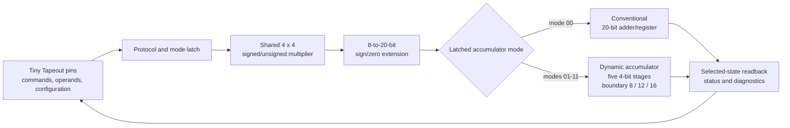

   

# TinyInt


TinyInt is a 1 x 1 Tiny Tapeout research vehicle for comparing a conventional
20-bit accumulator with a bit-exact dynamic accumulator behind the same
signed/unsigned INT4 multiplier. The dynamic state is divided into five 4-bit
stages. Software selects an 8-, 12-, or 16-bit active boundary; higher stages
update only when a carry or borrow crosses that boundary. Every mode retains
the same full 20-bit modulo result.

The current RTL is the conventional baseline. The frozen target architecture,
protocol, verification gates, and measurement method are in the
[project specification](project-description.md). The literature review and
research plan are in the [research proposal](research-proposal.md).

## Target interface

- `ui_in[3:0]`: operand B during `MAC`
- `ui_in[7:4]`: operand A during `MAC`
- `uio_in[4]`: signed mode, sampled by `CLEAR`
- `uio_in[3:1]`: command (`000` `FINISH`, `001` `CLEAR`, `010` `MAC`,
  `011` `MAC_LAST`, `100` `READ`)
- `uio_in[0]`: command valid
- `uio_out[5]`: ready
- `uio_out[6]`: registered response valid
- `uio_out[7]`: busy, reserved low
- `uo_out[7:0]`: registered read response

`CLEAR` also latches its payload: `ui_in[1:0]` selects conventional,
dynamic-8, dynamic-12, or dynamic-16, and `ui_in[2]` enables exact zero-product
skipping. `ui_in[7:3]` must be zero during `CLEAR`. The physical pinout is
unchanged from the baseline.

## Target architecture



The nonselected accumulator is operand-isolated and state-disabled. Baseline-
only and dynamic-only builds will be synthesized separately for uncontaminated
area/timing estimates; the composite tapeout enables same-die active-energy
A/B measurements.

## Verification

Run the existing baseline Cocotb regression with:

```sh
make test=ALL
```

Before tapeout, the dynamic revision must add exhaustive multiplier and
one-step boundary tests, formal equivalence for arbitrary streams, randomized
protocol tests, gate-level regression, post-layout activity/power analysis,
and clean timing/DRC/LVS results. The same vectors will be reused post-silicon
through the Tiny Tapeout SDK or `microcotb`.

## Tiny Tapeout

Tiny Tapeout makes it practical to manufacture small digital and mixed-signal
designs. See the [Tiny Tapeout documentation](https://tinytapeout.com/) and the
[local hardening guide](https://www.tinytapeout.com/guides/local-hardening/).
