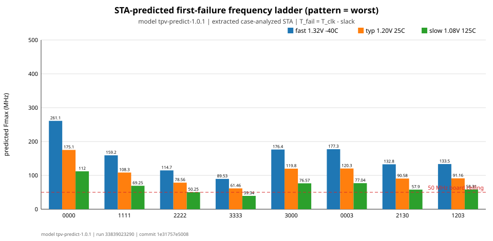
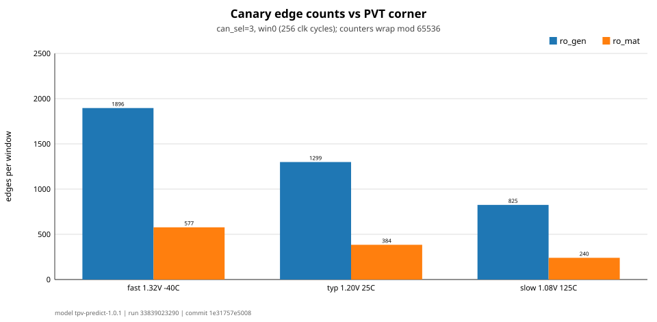

# Draft Pre-Silicon Technical Report

## Predicting Workload-Dependent Arithmetic Timing Failure with Low-Cost On-Chip Delay Proxies

| Draft metadata | Value |
| --- | --- |
| Status | Draft; pre-silicon results only |
| Process and shuttle | IHP SG13G2, Tiny Tapeout `ttihp26b`, 1x1 tile |
| Hardware and analysis revision | `1e31757e50080b19fa7642b8b9cd6822f64b1d11` |
| Canonical implementation run | GitHub Actions run [`33839023290`](https://github.com/ECHO-HELLO-WORLD424/tinyint-ttihp26b/actions/runs/33839023290) |
| Prediction model | `tpv-predict-1.0.1` |
| Authors and affiliation | TODO |

> This document is intentionally a draft. It records the research motivation,
> experimental design, and pre-silicon evidence before silicon measurements are
> available. Post-silicon results are left as explicit TODOs so that predictions are
> not revised after observing the chip.

## Abstract

Conventional static timing analysis predicts whether a synchronous design meets a
specified clock period, but the first observable failure of a fabricated circuit also
depends on voltage, temperature, workload, physical variation, and the relationship
between the analyzed path and the applied input sequence. On-chip delay monitors can
track some of these effects, yet a generic inverter ring oscillator need not scale like
the logic path it is intended to represent. This work implements a small silicon test
vehicle that compares three pre-silicon predictors of the workload-dependent failure
boundary of a deliberately slow arithmetic carry path: case-analyzed post-route static
timing analysis, a generic inverter ring oscillator, and a structure-matched ring
oscillator. A short, bit-serial reference adder detects incorrect results independently
of the delayed carry path.

The design targets one Tiny Tapeout tile in the IHP SG13G2 open process. The pre-silicon
package includes RTL and gate-level functional regression, physical signoff,
configuration-specific extracted timing analysis, an SDF timing-boundary sweep, an
extracted broken-loop ring-oscillator delay model, and a frozen prediction and
calibration protocol. For the longest delay configuration and worst-carry workload,
case-analyzed timing predicts first-failure knees of 89.53 MHz, 61.46 MHz, and
39.34 MHz at the selected fast, typical, and slow analysis corners. The present
ring-oscillator prediction is first-order: it includes routed parasitics but not
closed-loop transistor-level transient behavior. A reproducible SPICE extension is
therefore specified in this report. The principal experimental risk is that the
fabricated test setup may not provide enough voltage and temperature range to move the
failure knee below the platform's 50 MHz clock limit. No post-silicon claims are made
in this draft.

## 1. Background, related work, and motivation

Silicon timing margins are normally chosen conservatively so that a design operates
over a specified range of process, supply voltage, temperature, and aging. That
practice is appropriate for product signoff, but it obscures several questions that
are experimentally interesting: how close the model is to the actual failure
boundary, whether that boundary depends on workload, and how well a small on-chip
monitor predicts the delay of a structurally different data path.

In-situ timing-error schemes such as Razor and RazorII directly observe late data at
the endpoint and can support aggressive voltage or frequency operation [1], [2]. Other
resilient-circuit work has developed metastability-tolerant error detection and
recovery for dynamic variation [3]. These techniques are powerful, but they add
endpoint circuitry and recovery mechanisms that are unnecessary for the present
measurement goal. This chip instead uses a conventional capture register followed by
an independently clocked functional oracle. It asks a narrower metrology question:
how accurately can pre-silicon timing models and two inexpensive delay proxies locate
the first-failure boundary of a known arithmetic path?

Replica paths and ring oscillators offer an attractive alternative when direct
endpoint instrumentation is too expensive. Tunable replica circuits have been used to
track voltage, temperature, and aging [4], while ring oscillators are widely used to
characterize process and variability [5]. The limitation is representativeness. A
generic inverter loop measures the behavior of its own cells, loads, and routing; it
does not automatically reproduce the sensitivity of a carry chain or another complex
critical path. The original Razor work also cautioned that an inverter delay chain may
not scale like a complex critical path across voltage and temperature [1]. Path-RO
embeds a selected path into an oscillating structure [6], and
design-dependent ring oscillators select monitor stages to better match a target
design's delay sensitivity [7]. Chan et al. reported lower mean delay-estimation error
for design-dependent monitors than for inverter-only monitors, reinforcing the need to
test structural matching rather than assume it [7].

This project is enabled by two pieces of open infrastructure. Tiny Tapeout provides a
shared, small-area route to fabricated silicon [8], while the IHP open PDK exposes a
manufacturable SG13G2 design environment [9], [10]. The small tile and restricted I/O
budget make it impossible to reproduce a large adaptive processor experiment, but they
are sufficient for a controlled comparison across path length, workload, ring-
oscillator type, voltage, temperature, and clock frequency.

The research gap targeted here is not the absence of replica paths or matched
oscillators; both have substantial precedent. It is the lack, within the scope of this
project's survey, of a compact and reproducible open-PDK experiment that compares a
generic oscillator, a structure-informed oscillator, and configuration-specific
extracted STA against the same workload-dependent arithmetic failure surface. The
intended original contribution is therefore **experimental quantification**, not a new
canary architecture. The study will provide a paired pre-silicon/post-silicon dataset
and compare prediction error, missed failures, false warnings, and guardband cost for
three predictors under the same physical implementation and measurement conditions.

## 2. Central research question and hypotheses

The central research question is:

> How accurately can extracted pre-silicon timing analysis and two low-cost on-chip
> delay proxies predict the workload-dependent first-failure boundary of an arithmetic
> carry path across voltage, temperature, frequency, and configured path length?

The corresponding subquestions are:

1. How closely does case-analyzed, post-route extracted STA predict the observed DUT
   failure boundary for a sensitizable runtime path?
2. Does a structure-matched ring oscillator track changes in the arithmetic DUT better
   than a generic inverter ring oscillator?
3. How much does workload change the DUT boundary at fixed path configuration and PVT?
4. How much does a predeclared one-point calibration improve each predictor, and what
   guardband is required to avoid missed failures?

The working hypotheses, to be tested rather than assumed, are:

- **H1:** Case-analyzed extracted STA will be the strongest uncalibrated predictor when
  the reported startpoint, endpoint, configuration, and sensitizing workload correspond
  to the measurement.
- **H2:** The structure-matched oscillator will track non-nominal changes in DUT delay
  better than the inverter oscillator because its loop includes delay-bank and adder
  structures resembling the DUT.
- **H3:** Worst-carry patterns will produce a lower failure-frequency boundary than
  carry-free or static patterns at the same delay configuration.
- **H4:** One-point multiplicative calibration will reduce systematic predictor bias,
  but will not remove mismatch in PVT or workload sensitivity.

## 3. Test-vehicle architecture

The top-level module is `tt_um_echoworld424_tpv`. It uses the standard Tiny Tapeout
eight-bit input, eight-bit output, and eight-bit bidirectional interface. A 16-bit
configuration word is captured while reset is asserted and committed during the first
three clocks after reset release. Measurements are organized into 19-cycle frames.

**Figure 1 required — system architecture.** Show the pattern generator, segmented
ripple-carry DUT, one-shot result register, serial checker, error counters, both ring
oscillators, window counters, configuration capture, freeze control, and serial
readout. Distinguish the synchronous measurement path from the asynchronous RO loops.

### 3.1 Deliberately slow arithmetic DUT

The DUT is a 16-bit ripple-carry adder divided into four 4-bit segments. Each segment
boundary contains a selectable delay bank with settings corresponding to 0, 16, 32,
or 48 inverter pairs. Four independent two-bit settings create a programmable family
of carry paths. This provides multiple timing knees on one die and permits the study
to compare configurations without depending on die-to-die variation.

The arithmetic operands are generated on chip. Available workloads are PRBS,
worst-case carry propagation, carry-free alternating activity, and static hold. The
operands remain stable across the DUT capture interval and the subsequent checker run.

**Figure 2 required — DUT path structure.** Show the four 4-bit ripple-carry segments,
the four selectable delay banks, the carry direction, the operand and carry sources,
and the one-shot capture endpoint. Label delay settings in inverter pairs.

### 3.2 Independent reference and failure observation

A short-path bit-serial 17-bit reference adder acts as the functional oracle. At the
start of an operation, `result_reg` captures the DUT output exactly once. It then holds
that value while the serial checker calculates the expected result. This one-shot
behavior is essential: if the DUT result were sampled repeatedly, a late but eventually
settled value could overwrite the failed sample and hide a timing error.

The error and operation counters are 16-bit saturating counters. The design also
records the low byte of the first failing DUT result. `FORCE_ERR` provides a functional
test of the error-detection and readout path without relying on an actual timing
failure.

**Figure 3 required — 19-cycle measurement timeline.** Mark operand launch/stability,
the single DUT capture event, checker start, the 17 serial addition steps, comparison,
counter update, and the interval during which `result_reg` must hold.

### 3.3 Generic and structure-matched canaries

The generic canary is an inverter-line ring oscillator. The matched canary incorporates
logic intended to resemble the DUT delay banks and full-adder carry structure. Both
oscillators have a selectable delay setting and are observed using windowed edge
counters. The window can be 2^8, 2^10, 2^12, or 2^14 system-clock cycles. The 16-bit
canary counters wrap modulo 65,536, so long-window settings must be interpreted with
care; they are not saturating counters.

`FORCE_CAN` provides a deterministic test mask for canary readout. Both oscillators are
asynchronous intentional combinational loops. Their timing arcs are disabled for
ordinary synchronous P&R analysis; that exception is not itself a frequency model.

**Figure 4 required — canary comparison.** Place simplified generic and matched loop
schematics side by side. Label the enable gate, selectable stages, structural stages,
loop closure, routing/load, and counter-clock load. This figure should make the
similarities and differences visible without requiring the reader to inspect RTL.

### 3.4 Configuration and readout

The configuration is `{uio_in, ui_in}` while reset is low. Bits `[7:0]` select the four
DUT delay banks, `[9:8]` select workload, `[11:10]` select canary delay, `[13:12]`
select window length, and bits `[14]` and `[15]` are `FORCE_CAN` and `FORCE_ERR`.
During measurement, `ui_in[7]` is reused as `FREEZE`. The host holds it low while an
experiment runs and high for quiescent readout. The complete protocol is defined in
[`info.md`](info.md).

## 4. Pre-silicon methodology

All numerical results in this draft are tied to hardware and analysis revision
`1e31757e50080b19fa7642b8b9cd6822f64b1d11`. The canonical physical implementation is
GitHub Actions run `33839023290`; the prediction model is `tpv-predict-1.0.1`. Exact
artifact identities and hashes are recorded in the run manifests rather than inferred
from current branch state.

### 4.1 Functional verification

The RTL cocotb regression contains ten passing tests. It covers configuration capture,
frame sequencing, one-shot DUT capture, pattern operation, error injection, canary
forcing, freeze and readout, and counter behavior. The functional gate-level
regression reports eight passes and two intentional skips. That gate-level test uses
zero-delay simulation: specify blocks are removed, SDF is not annotated, and RO loop
cells are stripped. It verifies synthesized control and protocol behavior, but it is
not evidence for a timing boundary or oscillator frequency.

### 4.2 Physical implementation and signoff

The design was hardened with the IHP SG13G2 flow for a 1x1 Tiny Tapeout tile and a
20 ns submitted clock period. The canonical run reports 2,610 placed instances,
including 1,747 standard cells and 863 filler cells, with 82.86% utilization. DRC,
Magic DRC, LVS, antenna, and power-grid checks report zero errors.

Hold slack is positive at the analyzed fast, typical, and slow corners: 0.1353 ns,
0.2260 ns, and 0.3893 ns respectively. Global setup slack is 8.5709 ns, 3.3190 ns,
and -6.0742 ns. The slow-corner global violation is not used as the experimental
boundary because its reported startpoint is static configuration state `cfg[8]`.
Instead, the experiment-specific analysis described below constrains configuration and
reports paths from runtime-changing pattern state to the one-shot DUT capture register.

**Figure 5 required — annotated layout.** Use the final GDS or routed DEF to identify
the arithmetic DUT, its delay banks, the generic and matched RO loops, checker/control,
and counter/readout regions. Include scale and routing context. A screenshot without
these annotations is insufficient.

### 4.3 Configuration-specific extracted STA

The experiment STA flow applies static case analysis to configuration bits, selects a
workload, and searches for setup paths ending at `result_reg` whose startpoints are
runtime-changing `u_pat.lfsr` or `u_pat.idx` state. This avoids conflating a global
static-configuration path with the path exercised during measurement.

The analysis covers three timing corners, eight representative segment configurations,
and four workloads, producing 96 rows in
[`experiment_sta.csv`](../data/experiment_sta.csv). For each row, the dataset records
corner, voltage, temperature, segment selection, workload, startpoint, endpoint, data
arrival time, required time, slack, and predicted failure-frequency boundary.

The STA frequency predictor is derived from the path delay rather than directly from
the submitted 20 ns constraint:

```text
T_path = T_clock - slack
P_STA  = 1000 / T_path
```

where time is in nanoseconds and frequency is in megahertz. A representative reported
path and its sensitizing sequence must accompany the final report.

**Figure 6 required — representative analyzed path.** Show one longest-configuration,
worst-carry path from runtime pattern state through the segmented carry/delay structure
to `result_reg`, with extracted per-stage or grouped delay contributions. Include the
case assumptions and corner.

### 4.4 SDF timing-boundary sweep

Timing simulation provides an independent check that a sensitizing workload produces
an observable error around the STA prediction. The current post-route SDF fixture has
13 recorded rows in [`sdfsim.csv`](../data/sdfsim.csv), including a zero-delay reference
and a retained but invalid RO cross-check row. In the valid DUT boundary subset, the
longest delay configuration and worst-carry workload fails at 14 ns and passes at
16 ns at the typical corner; it fails at 22 ns and passes at 24 ns at the slow corner.
Relative to the pass/fail midpoint, the STA boundary is 1.27 ns more conservative at
typical and 2.42 ns more conservative at slow, corresponding to 8.47% and 10.52%.

This evidence is useful but limited. The present annotation is IOPATH-only; routed
interconnect delay is not annotated into the timing simulation. Therefore the SDF
sweep is a sensitization and boundary sanity check, not a full substitute for
parasitic-aware STA or extracted transistor simulation.

**Figure 7 required — SDF boundary sweep.** Plot pass/fail or measured error rate
against clock period for each simulated corner and selected segment configuration.
Overlay the corresponding STA boundary and visually mark censored intervals between
the last failing and first passing test point.

### 4.5 First-order extracted RO prediction

Because ordinary STA cannot time a closed combinational loop, the current RO flow
breaks each loop at a declared point and sums parasitic-aware static stage delays from
the routed netlist and SPEF. Predictions cover two oscillator types, four canary delay
settings, and three corners, producing 24 rows in
[`ro_predict.csv`](../data/ro_predict.csv). The loop period is approximated from the
sum of rising and falling propagation delays, and the expected counter value is derived
from the predicted oscillator frequency and selected observation window.

This is a first-order model. It includes routed parasitics but not transistor-level
slew evolution, closed-loop loading, supply-dependent waveform shape, oscillator
startup, or dynamic current and supply interaction. Section 7.2 specifies the
transient SPICE simulation needed to reduce this weakness.

### 4.6 Predictor construction and frozen calibration

The prediction dataset contains 288 rows in
[`predictions.csv`](../data/predict/predictions.csv): three predictors across three
corners, eight segment configurations, and four workloads. The uncalibrated predictors
are:

```text
P_STA(c, s, w) = 1000 / T_STA(c, s, w)

P_GEN(c, s, w) = P_STA(nominal, s, w)
                 * N_GEN(c) / N_GEN(nominal)

P_MAT(c, s, w) = P_STA(nominal, s, w)
                 * N_MAT(c) / N_MAT(nominal)
```

Here `c`, `s`, and `w` denote PVT corner, segment configuration, and workload, while
`N_GEN` and `N_MAT` are predicted generic and matched RO counts. By construction, all
three predictors agree at the nominal anchor; their test is how differently they scale
away from nominal conditions.

The calibration protocol is declared before silicon measurement. Each predictor may
receive one multiplicative scale factor derived from the nominal longest-path,
worst-carry observation. If that anchor is right-censored by the 50 MHz platform limit,
the predeclared fallback is the corresponding slow-condition anchor. Calibration will
not be refit separately for every workload, segment setting, or PVT point.

The final analysis will compare absolute and relative boundary error, missed-failure
probability, false-warning rate, and guardband cost. All four recorded thresholds—first
error, 10^-6, 10^-4, and 10^-2 errors per operation—will be retained rather than
selectively reporting the most favorable one.

## 5. Pre-silicon results

Table 1 summarizes the main completed evidence. These results establish that the chip
is implementable and that the selected path family is likely to cross the measurement
range under at least some PVT conditions. They do not establish predictor accuracy on
silicon.

| Evidence | Result | Interpretation |
| --- | ---: | --- |
| RTL regression | 10/10 pass | Control and measurement behavior verified in RTL |
| Functional gate-level regression | 8 pass, 2 intentional skip | Synthesized protocol verified without timing or live ROs |
| Physical checks | 0 DRC, Magic DRC, LVS, antenna, or power-grid errors | Canonical layout passes reported implementation checks |
| Utilization | 82.86% | Design fits the 1x1 tile with limited spare area |
| Experiment STA rows | 96 | 3 corners × 8 segment configurations × 4 workloads |
| SDF sweep rows | 13 recorded | DUT boundary checks plus retained zero-delay and invalid RO provenance rows |
| RO prediction rows | 24 | 3 corners × 4 canary settings × 2 ROs |
| Combined prediction rows | 288 | 3 predictors over the complete declared comparison grid |

For segment setting `3333` and the worst-carry workload, the extracted STA predictions
are:

| Corner | Predicted first-failure frequency |
| --- | ---: |
| Fast | 89.53 MHz |
| Typical | 61.46 MHz |
| Slow | 39.34 MHz |

Across the slow-corner worst-carry configuration ladder, the predictions span roughly
39.3–112 MHz. Segment setting `2222` is predicted near 50.25 MHz and is therefore a
useful configuration near the platform limit.



**Figure A (existing draft figure).** Predicted DUT timing-knee ladder. The final
version should add a readable caption specifying analysis corner, voltage,
temperature, uncertainty treatment, and whether values are censored by the intended
clock sweep.

For canary setting 3 and the shortest observation window, the predicted counts are:

| Corner | Generic RO count | Matched RO count |
| --- | ---: | ---: |
| Fast | 1,896 | 577 |
| Typical | 1,299 | 384 |
| Slow | 825 | 240 |

The shortest window fits within the 16-bit counter at all analyzed corners. The
longest window wraps the generic counter at fast and typical conditions; this behavior
is expected and must be handled by the host analysis rather than mistaken for
saturation.



**Figure B (existing draft figure).** First-order parasitic-aware canary-count
predictions. The final version should distinguish raw, wrapped, and reconstructed
counts and later overlay transistor-level SPICE and silicon observations.

## 6. Interpretation and scope of the contribution

The current evidence supports a feasible silicon experiment with an auditable
pre-silicon baseline. It also demonstrates why a conventional global worst-slack number
is not sufficient: the audited global slow-corner violation begins at static
configuration state, whereas the experiment requires a runtime-sensitizable path to a
one-shot capture endpoint. The case-analyzed dataset provides that more defensible
connection.

The work should not claim a novel ring-oscillator topology. The matched oscillator is
best described as a low-cost, structure-informed proxy motivated by prior replica-path,
Path-RO, and design-dependent monitor research. The contribution will be the controlled
comparison of this proxy, an inverter proxy, and extracted STA against the same
workload-dependent silicon failure surface, together with the released methodology and
data.

The planned experiment can characterize within-die PVT, configuration, and workload
behavior. If only one packaged die is measured, it cannot characterize a manufacturing
process distribution. Any process-general conclusion must therefore be phrased as a
hypothesis for future multi-die work rather than a result of this chip.

## 7. Weaknesses, threats to validity, and mitigation

### 7.1 Weakness 1: the reachable measurement envelope is not yet guaranteed

This is the largest risk to the central research question. The platform clock is
limited to 50 MHz, while the longest-path, worst-carry prediction at the typical corner
is 61.46 MHz. The predicted in-range knee of 39.34 MHz occurs at the selected slow
analysis condition of 1.08 V and 125 °C. The currently anticipated laboratory setup
may reach only about 85 °C, and the Tiny Tapeout carrier may not expose safe independent
control of the core supply. If the chip remains too fast at the lowest reachable
voltage and highest reachable temperature, every DUT sweep will be right-censored at
50 MHz. The chip would still provide RO/PVT data, but comparison of failure-boundary
predictors would be weak or impossible.

Mitigation before measurement should be treated as a go/no-go task:

1. Verify the exact carrier-board power topology, regulator, measurement points, safe
   voltage limits, and whether the DUT core rail can be driven independently.
2. Characterize the clock source and confirm the achievable frequency grid and jitter
   up to 50 MHz.
3. Use transient or extracted simulations at the actually reachable voltage and
   temperature combinations, not only library signoff corners.
4. Predeclare how censored observations will be reported. Do not extrapolate an
   unobserved knee as if it had been measured.
5. Prioritize `3333`, `3332`, and `3322` at the hottest, lowest-voltage safe condition;
   use `2222` as an additional near-limit configuration.
6. If the accessible envelope cannot generate failures, narrow the final claim to
   delay-proxy tracking and an experimentally established lower bound on the DUT
   boundary.

No RTL change should be made merely to force an easier result unless a new tapeout is
still possible and all pre-silicon artifacts are regenerated from the new revision.

### 7.2 Weakness 2: RO prediction is first-order rather than transient

The present broken-loop static-delay model is reproducible and parasitic-aware, but it
does not establish that the physical loop starts, reaches the assumed waveform, or
oscillates at the frequency inferred from isolated timing arcs. It may also mis-rank
the generic and matched monitors if their slew, duty-cycle, internal-state, or load
effects differ.

The recommended extension is a focused **ngspice transistor-level transient flow**
using the exact pinned IHP SG13G2 model and standard-cell SPICE views from the build.
Full-chip transistor simulation is unnecessary and likely impractical. Extract a
minimal subcircuit for each oscillator that includes the enable gate, selectable
delay/tap cells, matched adder logic where applicable, loop closure, inserted buffers,
and the first counter-clock load.

Run the work in two levels so that discrepancies can be localized:

1. **Cell-only transient:** transistor-level standard cells and explicit external
   loads, without routed RC.
2. **Post-route transient:** the same cells plus SPEF-derived resistor and capacitor
   parasitics for the physical loop and its load.

The minimum matrix is 24 cases: two oscillator types × four canary delay selections ×
three MOS corners. Use `mos_ff`, `mos_tt`, and `mos_ss` with the same voltage and
temperature identities as the timing datasets. Add continuous voltage and temperature
points only after the carrier-board envelope is known.

Each simulation should:

- ramp the supply and exercise the real enable transition;
- include a documented small initial perturbation when needed to avoid a perfectly
  symmetric numerical equilibrium;
- report startup success and startup time separately from steady-state frequency;
- discard startup cycles and measure at least 20–50 steady-state periods;
- record mean period, cycle-to-cycle variation, duty cycle, peak and average supply
  current, and predicted counter value for every hardware window;
- repeat with smaller maximum timestep and tighter tolerances until period changes are
  below a predeclared convergence threshold;
- record simulator, model, standard-cell, extraction, PDK, and source revisions.

Pin mapping is a specific implementation risk. Do not infer SPICE subcircuit terminal
order from LEF or from Verilog declarations. Parse each `.subckt` signature from the
exact pinned `sg13g2_stdcell.spice` used by the build and map it explicitly to named
Verilog ports. IHP issue 810 documents historical inconsistencies among SPICE, CDL, and
LEF pin order [11]. A one-cell truth-table/transient fixture should validate every cell
type before constructing the loop.

Proposed reproducible outputs are:

```text
tools/spice/extract_ro.py
tools/spice/run_ro_transient.py
tools/spice/decks/
data/ro_spice.csv
data/ro_spice.json
```

`data/ro_spice.csv` should contain run identity, physical loop identity, RO type,
canary selection, MOS corner, voltage, temperature, extraction level, startup status,
period, frequency, duty cycle, current, convergence settings, and projected counts.
The report should then compare broken-loop prediction, cell-only transient,
post-route transient, and silicon measurement. Magic `ext2spice` can be used as an
independent extraction cross-check. Xyce may be useful as a secondary simulator, but
ngspice is the suggested reference because it is open, scriptable, and commonly used
with open-PDK SPICE models.

### 7.3 Additional threats

- **SDF incompleteness:** IOPATH-only annotation omits routed interconnect. Mitigate by
  retaining extracted STA as the principal path model and clearly labeling SDF as a
  sensitization check.
- **Canary counter aliasing:** 16-bit wrap can make a high count look low. Use a
  non-wrapping window where possible and reconstruct modulo counts only when adjacent
  settings make the unwrap unambiguous.
- **Reference-path assumption:** the checker must remain faster than the delayed DUT.
  Preserve checker timing evidence at every claimed PVT point and treat any checker
  violation as an invalid observation.
- **Workload coverage:** four on-chip pattern modes do not span arbitrary software
  activity. Claims should be restricted to the implemented patterns and the specific
  path family.
- **Limited samples:** one die supports within-die validation, not process-distribution
  statistics. Report repeated-trial uncertainty separately from across-die variation.
- **Model dependence:** the canary predictors inherit the nominal STA ladder by
  construction. Their nominal agreement is not independent evidence; only their
  non-nominal scaling and post-calibration holdout performance are comparative tests.

## 8. Post-silicon methodology and results — TODO

No post-silicon data are available in this draft. The detailed acquisition order,
metadata schema, threshold definitions, calibration rule, retry policy, and exclusion
policy are frozen in [`post-silicon-protocol.md`](post-silicon-protocol.md). They should
not be revised after inspecting results except through a dated, explicitly justified
amendment.

The final report must complete the following items:

- TODO: identify each die, package, carrier board, regulator arrangement, clock source,
  instruments, firmware/host-software revision, and calibration date;
- TODO: document the safely reachable voltage, temperature, and frequency envelope;
- TODO: run deterministic bring-up with `FORCE_ERR` and `FORCE_CAN`;
- TODO: collect raw canary counts before DUT frequency sweeps at every PVT point;
- TODO: measure repeated DUT sweeps for every declared segment/workload configuration;
- TODO: retain first-error, 10^-6, 10^-4, and 10^-2 error-rate boundaries, including
  left- or right-censoring;
- TODO: apply the frozen uncalibrated and one-point calibrated predictors;
- TODO: compute prediction error, missed-failure probability, false-warning rate,
  guardband cost, repeatability, and confidence intervals;
- TODO: publish raw and derived machine-readable data with complete provenance;
- TODO: discuss discrepancies without deleting negative or inconvenient results.

## 9. Figures and tables required for the final report

The two generated prediction plots are useful but are not enough for a complete
technical report. The following figure plan distinguishes existing material from work
that remains.

| No. | Figure | Status | Required content |
| ---: | --- | --- | --- |
| 1 | Test-vehicle block diagram | Required pre-silicon | All measurement blocks, clock/reset/config/freeze/readout, synchronous versus asynchronous domains |
| 2 | Segmented DUT schematic | Required pre-silicon | Four carry segments, selectable delay banks, settings, launch and capture points |
| 3 | 19-cycle timing diagram | Required pre-silicon | One-shot capture, checker sequence, compare and counter update |
| 4 | Generic versus matched RO | Required pre-silicon | Stage composition, enable, selectable delay, closure, load and counter interface |
| 5 | Annotated final layout | Required pre-silicon | Physical locations of DUT, delay banks, both ROs, checker/control and counters |
| 6 | Representative extracted STA path | Required pre-silicon | Runtime startpoint, case assumptions, carry path, endpoint and delay breakdown |
| 7 | Predicted DUT knee ladder | Existing; revise caption/style | Corner/PVT identity, workloads, configurations, platform-limit annotation |
| 8 | Predicted RO counts | Existing; extend | Raw/wrapped counts and later broken-loop/SPICE/silicon overlays |
| 9 | SDF boundary sweep | Required pre-silicon | Pass/fail or error rate versus period, STA overlays and censored intervals |
| 10 | STA-versus-SDF comparison | Required pre-silicon | Absolute and percentage boundary differences across available cases |
| 11 | RO model comparison | Pending SPICE | Broken-loop, cell-only transient and extracted transient frequency/count error |
| 12 | Laboratory setup diagram/photo | TODO post-silicon | Board rails, clock, thermal control, instruments and readout path |
| 13 | Measured failure surface | TODO post-silicon | Error-rate contours over voltage, temperature, frequency, workload and path length |
| 14 | Predictor accuracy | TODO post-silicon | Predicted versus measured knees before/after calibration with censoring marked |
| 15 | Safety/guardband tradeoff | TODO post-silicon | Missed failures, false warnings and guardband cost for all three predictors |

The final report also needs three compact tables: the complete configuration/readout
map, a signoff/provenance summary, and a measurement-count/missing-data summary. Tables
should be generated from machine-readable sources where possible rather than copied by
hand.

## 10. Reproducibility and data availability

The repository separates raw or intermediate measurements from derived predictions.
Key pre-silicon sources are:

- [`experiment_sta.csv`](../data/experiment_sta.csv) — case-analyzed extracted DUT
  path timing;
- [`sdfsim.csv`](../data/sdfsim.csv) — timed-simulation boundary observations;
- [`ro_predict.csv`](../data/ro_predict.csv) — broken-loop parasitic-aware RO model;
- [`predictions.csv`](../data/predict/predictions.csv) and
  [`predictions.json`](../data/predict/predictions.json) — frozen combined prediction
  package;
- [`summary.md`](../data/predict/summary.md) — generated model summary;
- [`PRE_SILICON_ACTION_PLAN.md`](../PRE_SILICON_ACTION_PLAN.md) — audited readiness and
  definition-of-complete record;
- [`manifest.json`](../artifacts/run-33839023290/manifest.json) — source, tool,
  artifact, and hash provenance for the canonical implementation run.

Any RTL, constraint, cell-wrapper, source-list, clock, or floorplan change invalidates
the numerical baseline until hardening, experiment STA, SDF, RO modeling, prediction
generation, and manifest creation are rerun from the new revision.

## 11. Conclusion

The pre-silicon work establishes a physically implemented and functionally verified
test vehicle for comparing extracted STA, a generic inverter canary, and a
structure-matched canary against the workload-dependent failure boundary of a
programmable arithmetic path. The primary intellectual contribution is the controlled,
reproducible comparison and its eventual open pre/post-silicon dataset, not a claim of
a fundamentally new monitor architecture.

Two limitations must remain central. First, the accessible board-level voltage and
temperature range may not move the DUT knee below 50 MHz; this could censor the main
experiment. Second, current RO predictions use a parasitic-aware broken-loop static
model rather than closed-loop transistor transient simulation. The ngspice plan in
Section 7.2 provides a bounded way to address the latter before silicon. Post-silicon
measurements, predictor scoring, and conclusions remain TODO.

## References

[1] D. Ernst et al., “Razor: A Low-Power Pipeline Based on Circuit-Level Timing
Speculation,” *36th Annual IEEE/ACM International Symposium on Microarchitecture*,
pp. 7–18, 2003. [Paper](https://american.cs.ucdavis.edu/academic/readings/papers/razor.pdf),
[DOI](https://doi.org/10.1109/MICRO.2003.1253179).

[2] S. Das et al., “RazorII: In Situ Error Detection and Correction for PVT and SER
Tolerance,” *IEEE Journal of Solid-State Circuits*, vol. 44, no. 1, pp. 32–48, 2009.
[Author manuscript](https://blaauw.engin.umich.edu/wp-content/uploads/sites/342/2017/11/398.pdf),
[DOI](https://doi.org/10.1109/JSSC.2008.2007145).

[3] K. A. Bowman et al., “Energy-Efficient and Metastability-Immune Resilient Circuits
for Dynamic Variation Tolerance,” *IEEE Journal of Solid-State Circuits*, vol. 44,
no. 1, pp. 49–63, 2009.
[Publication record](https://experts.illinois.edu/en/publications/energy-efficient-and-metastability-immune-resilient-circuits-for-/),
[DOI](https://doi.org/10.1109/JSSC.2008.2007148).

[4] J. Tschanz et al., “Tunable Replica Circuits and Adaptive Voltage-Frequency
Techniques for Dynamic Voltage, Temperature, and Aging Variation Tolerance,”
*2009 Symposium on VLSI Circuits*, pp. 112–113, 2009.
[Proceedings archive](https://archive.vlsisymposium.org/09web/circuits/technical.html).

[5] M. Bhushan et al., “Ring Oscillators for CMOS Process Tuning and Variability
Control,” *IEEE Transactions on Semiconductor Manufacturing*, vol. 19, no. 1,
pp. 10–18, 2006.
[IBM Research record](https://research.ibm.com/publications/ring-oscillators-for-cmos-process-tuning-and-variability-control).

[6] X. Wang, M. Tehranipoor, and R. Datta, “Path-RO: A Novel On-Chip Critical Path
Delay Measurement Under Process Variations,” *IEEE/ACM International Conference on
Computer-Aided Design*, pp. 640–646, 2008.
[Paper](https://www.cecs.uci.edu/~papers/iccad08/PDFs/Papers/08C.3.pdf),
[DOI](https://doi.org/10.1109/ICCAD.2008.4681644).

[7] T.-B. Chan, P. Gupta, A. B. Kahng, and L. Lai, “Synthesis and Analysis of
Design-Dependent Ring Oscillator (DDRO) Performance Monitors,” *IEEE Transactions on
Very Large Scale Integration Systems*, vol. 22, no. 10, pp. 2117–2130, 2014.
[Author manuscript](https://nanocad.ee.ucla.edu/wp-content/papercite-data/pdf/j31.pdf),
[DOI](https://doi.org/10.1109/TVLSI.2013.2282742).

[8] M. Venn, “Tiny Tapeout: A Shared Silicon Tapeout Platform Accessible to Everyone,”
*IEEE Solid-State Circuits Magazine*, vol. 16, no. 2, pp. 20–29, 2024.
[Preprint](https://theopenroadproject.org/wp-content/uploads/2024/07/paper_TT.pdf),
[DOI](https://doi.org/10.1109/MSSC.2024.3381097).

[9] K. Herman et al., “On the Versatility of the IHP BiCMOS Open Source and
Manufacturable PDK: A Step Towards the Democratization of Chip Design,” *IEEE
Solid-State Circuits Magazine*, vol. 16, no. 2, pp. 30–38, 2024.
[IEEE record](https://ieeexplore.ieee.org/document/10584389/),
[DOI](https://doi.org/10.1109/MSSC.2024.3372907).

[10] IHP, “IHP Open Source PDK,” official source repository.
[Repository](https://github.com/IHP-GmbH/IHP-Open-PDK).

[11] IHP Open PDK issue 810, “Pin order mismatch between SPICE/CDL and LEF.”
[Issue](https://github.com/IHP-GmbH/IHP-Open-PDK/issues/810).
