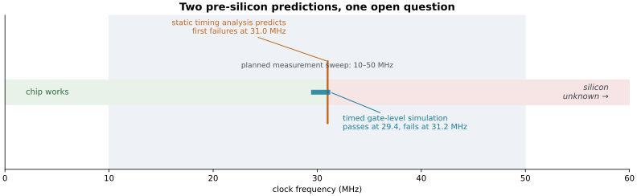
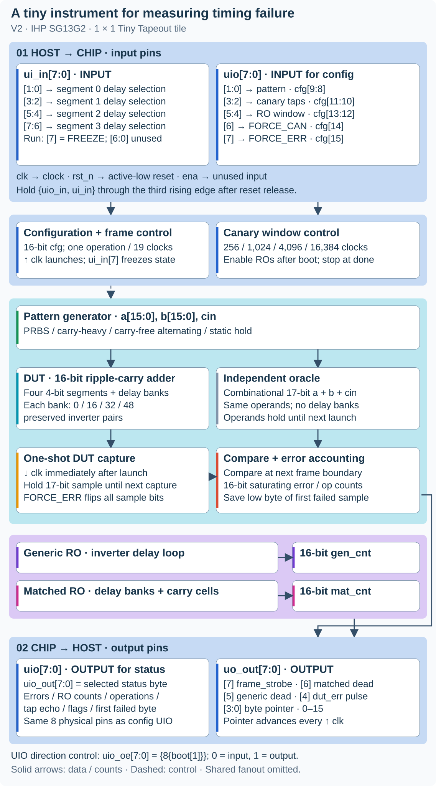
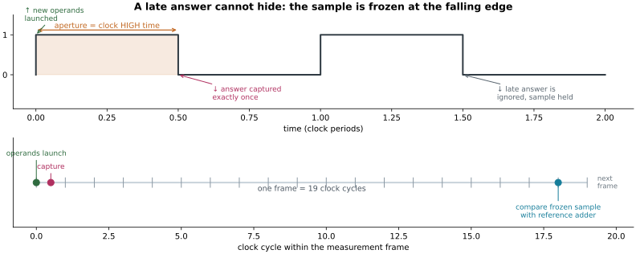
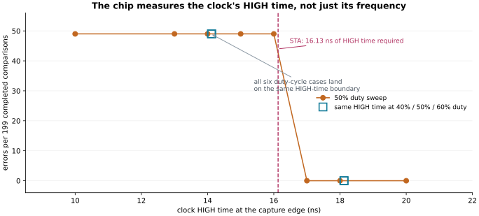
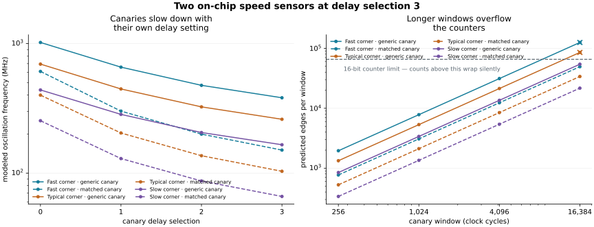
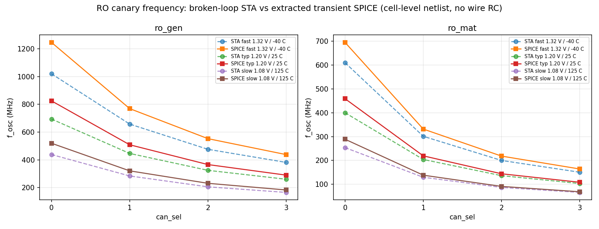

# How fast can a chip go before it starts getting the wrong answer?

*A one-tile silicon experiment that predicts its own failure point — and will tell us whether the prediction was right.*

Every digital chip has a speed limit. Push the clock a little faster, drop the supply a little lower, or let the die get hot, and eventually a signal arrives too late to be stored correctly. The chip does not crash or complain; it quietly returns a wrong number.

Engineers normally find that limit with software. A timing report estimates how long every path takes and declares how fast the design may safely run. But a report is a model of the chip, not the chip itself. This project builds a tiny piece of silicon whose only job is to expose the gap between the two.

> **The question:** how accurately can pre-build timing analysis and two cheap on-chip speed sensors predict the exact clock speed at which an arithmetic circuit starts producing wrong answers?

(state the key contribution of the work. The key contirbution should be open dataset obtained from fully open design/process/PDK)

## The short version

| | |
| --- | --- |
| **What we built** | One 1 × 1 [Tiny Tapeout](https://tinytapeout.com/) tile in the open IHP SG13G2 process (die 202 × 155 µm): a deliberately slow 16-bit adder, an independent reference adder, two ring-oscillator speed sensors, and counters that record failures. |
| **How it runs** | Submitted at a conservative **10 MHz**. The experiment deliberately overclocks to **10–50 MHz** to find the breaking point. |
| **Strongest result so far** | Timing analysis predicts first failures at **31.0 MHz** for the longest configured path at room conditions. A delay-annotated gate-level simulation passes at 29.4 MHz and fails at 31.2 MHz — the same place, from a completely different method. |
| **Status** | Design verified, hardened, and signoff-clean; the chip is **not back from the fab yet**. The silicon half of the experiment is still open, and the prediction protocol is frozen in advance. |

*If you want the engineering detail, the appendices hold every number generated so far.

**Definition of techinical jargons are in [Appendix A](#appendix-a--plain-language-glossary).

---

## 1. Define "too slow"

A digital chip is a very large collection of switches. When a switch flips, the change does not appear instantly at its output — it takes a little time to travel through the wire and the next gate. Individually that is picoseconds, but along a long path it adds up.

On each clock tick, **registers** take a snapshot of their input and hold it until the next tick. A **timing failure** happens when a snapshot is taken before the correct value has arrived: the register keeps the old value, and everything downstream of it is wrong. The fail is silent.

Three things make paths slower: a faster clock (less time per tick), a lower supply voltage, and a higher temperature. A chip that is perfectly correct at 10 MHz, 1.20 V, and 25 °C can fail at 50 MHz, or at 1.08 V, or when it is hot. Before a chip is built, software called **static timing analysis (STA)** estimates whether every path arrives in time, reporting **slack** — time to spare when positive, time missing when negative. This is how the industry decides how fast a design may run. But it is a model, and models disagree with reality in interesting ways. That disagreement is what this project plan to measure.

## 2. The experiment in one picture

Two predictions already exist, from completely different methods: static timing analysis, and a simulation of the manufactured gate netlist with per-cell delays annotated. They agree closely. What the real chip does is currently  unknown.



*Two independent pre-silicon predictions at nominal conditions, longest configured path, carry-heavy workload. The blue bar spans the tested simulation points: pass at 29.4 MHz, fail at 31.2 MHz. The shaded band is the planned 10–50 MHz sweep. Sources: [STA dataset](../data/safe10/experiment_sta.csv), [simulation dataset](../data/safe10/sdfsim.csv).*

The rest of this post explains how each prediction is made, what the design already proves, and what only silicon can settle.

## 3. Inside the chip: a suspect, a judge, and two stopwatches



*The design and complete host pin map, drawn from the [top-level RTL](../src/tt_um_echoworld424_tpv.v). UIO appears in both pin panels because the same eight pins receive configuration and later output status bytes. Colors match the placement map below. Solid arrows carry data or counts; dashed arrows are selected control paths. [Open the full-size SVG](figures/v2/chip-architecture.svg).*

**The suspect.** The [device under test](../src/tpv_rca16.v) is a 16-bit **ripple-carry adder** — the simplest way to add in hardware: bit 0 produces a carry and hands it to bit 1, which hands its carry to bit 2, and so on. The carry rippling end to end is the slowest thing in the design. To control how slow, the adder is split into four 4-bit segments, and each segment boundary has a **delay bank** that can insert 0, 16, 32, or 48 inverter pairs. One inverter flips the value; a pair leaves it unchanged but costs time. Four settings × four segments gives a programmable path length.

That delay must physically survive synthesis, which would otherwise delete redundant inverters. The design uses preserved cell wrappers, and the built netlist is inspected afterwards: **384 DUT-bank inverters and two oscillator loops are present** in the final layout ([structure audit](../data/safe10/verification/structure.json)).

**The judge.** A separate, deliberately fast [reference adder](../src/tpv_checker.v) computes the same sum with no delay banks. It always settles long before it is used, so any disagreement means the slow adder's answer was captured too late — not that the arithmetic is wrong.

**The shutter.** The trick that makes failures observable is *when* the answer is photographed. New operands launch on a rising edge; the DUT's 17-bit answer is captured **exactly once** on the immediately following falling edge, then held. If it was still settling at that instant, the wrong value is frozen in place and a later, correct result cannot overwrite it. At the next frame boundary — 19 clock cycles after launch — the frozen sample is compared with the reference and an error counter is bumped.

**How we lowered the required test frequency.** The earlier design gave the adder a full clock cycle to finish. Its longest path was predicted to fail near **61.5 MHz at 25 °C**, above our planned 50 MHz ceiling. Taking the snapshot on the falling edge gives it only half a cycle at 50% duty, so it can miss the deadline at a lower clock speed. With the same delay banks, the new predicted boundary is about **31 MHz at 25 °C**. This makes room-temperature testing plausible without requiring a 125 °C test; the actual silicon boundary still needs measuring ([original audit](area-temperature-feasibility-audit.md), [half-cycle validation](halfcycle-development-validation.md)). Normal operation remains **10 MHz**, giving the adder 50 ns to finish; the **10–50 MHz** sweep deliberately searches for failures.



*One measurement, in two views. Top: the clock's HIGH time is the aperture — how long the adder has to finish. Bottom: one frame is 19 clock cycles; operands launch at cycle 0, the sample is taken half a cycle later, and the comparison happens at cycle 18.*

**Four workloads.** A [pattern generator](../src/tpv_pattern_gen.v) feeds the adder four operand streams: pseudorandom (PRBS), a repeating carry-heavy sequence, an alternating carry-free pattern, and a static hold. They push the same hardware along different paths. "Carry-heavy" is a stimulus label, not a claim — the timing analysis separately has to show the sequence really sensitizes the predicted path, and it does for the carry-heavy and PRBS patterns.

**Two stopwatches.** The tile also carries two **ring oscillators** — loops of an odd number of inverters that oscillate on their own at a frequency set by gate speed. They are the chip's built-in speedometers: one a generic inverter line, the other *structure-matched*, passing through delay banks and carry stages to resemble the adder's timing composition ([canary RTL](../src/tpv_ro_canary.v)). Each drives a 16-bit counter.

## 4. Turning a timing report into a predicted speed

The experiment analysis fixes the configuration bits, then searches for paths that start at runtime-changing state (the operand registers) and end at the one-shot capture register. For a clock period `T`, HIGH-time fraction `d`, and extracted setup slack `S`, the required aperture is `d × T − S`. Setting the aperture to exactly what is required gives the predicted failure speed:

```text
required HIGH time = d × T − S
predicted boundary frequency (MHz) = 1000 × d / required HIGH time (ns)
```

At nominal conditions with `d = 0.5` and `T = 20 ns`, the carry-heavy path needs **16.13 ns** of HIGH time, predicting first failures at **31.0 MHz**. This is an estimate from extracted timing analysis — most trustworthy near the analyzed operating point, and reported with that caveat.

The important detail is *which* path is analyzed. The globally slowest path in the chip starts at static configuration bits that never change at runtime, so it answers a different question; the experiment analysis restricts itself to paths a real workload can actually excite.


*Left: more deliberate delay brings the predicted failure speed down into the planned sweep. Each point is one of the four ladder settings (0/16/32/48 inverter pairs per segment), carry-heavy workload. Right: the delay-annotated simulation fails near the predicted period at all three corners; dotted lines mark the timing-analysis predictions. Sources: [STA CSV](../data/safe10/experiment_sta.csv), [simulation CSV](../data/safe10/sdfsim.csv), replotted by [`plot_v2_blog.py`](../tools/plot_v2_blog.py).*

## 5. What the pre-silicon work already shows

**The delay settings work as designed.** At nominal conditions, stepping the four banks together from `0000` through `1111`, `2222`, and `3333` lowers the predicted carry-heavy boundary from **84.5** to **53.5**, **39.2**, and **31.0 MHz** — so the longest setting puts the predicted transition inside the planned sweep. A configuration that stays error-free up to 50 MHz is recorded as "beyond the measured range", never assigned a boundary of 50 MHz.

**A timed workload really does fail.** Running the routed netlist with cell delays annotated, at the longest delay setting and with the carry-heavy workload, gives a clean fail/pass transition at every corner:

| Library corner | STA boundary | Last failing tested period | First passing tested period | STA minus bracket midpoint |
| --- | ---: | ---: | ---: | ---: |
| Fast · 1.32 V · −40 °C | 45.13 MHz (22.16 ns) | 20 ns | 22 ns | +1.16 ns (+5.5%) |
| Typical · 1.20 V · 25 °C | 31.00 MHz (32.26 ns) | 32 ns | 34 ns | −0.74 ns (−2.2%) |
| Slow · 1.08 V · 125 °C | 19.90 MHz (50.24 ns) | 46 ns | 48 ns | +3.24 ns (+6.9%) |

*199 completed comparisons per point. The timing analysis lands within 3.3 ns of the simulated transition at every corner — agreement between two independent models, not yet evidence about silicon.*

**The right clock property is being measured.** If the chip reacted to frequency alone, changing the duty cycle would move the failure point. It does not. At a fixed **14 ns of HIGH time** — reached with three different period/duty combinations — the simulation produces exactly **49 errors in 199 comparisons** every time; at **18 ns**, none. Timing analysis independently asks for 16.13 ns. The capture aperture, not the raw frequency, is the variable that matters.



*Errors per 199 comparisons as a function of the clock's HIGH time. Circles are the 50%-duty period sweep; hollow squares repeat the same HIGH time at 40%, 50%, and 60% duty. All six duty-cycle cases fall on the same boundary, close to the 16.13 ns the timing analysis requires. Source: [aperture check](../data/safe10/verification/aperture-check.json).*

**Workload matters, and the model says so.** The same hardware, at the same delay setting, has very different predicted limits depending on what it is asked to do:

| Workload | Nominal predicted boundary | What it exercises |
| --- | ---: | --- |
| Carry-heavy | 31.0 MHz | Worst-case carry propagation through every delay bank |
| PRBS | 31.4 MHz | Pseudorandom operands; nearly the same path |
| Carry-free alternating | 306.7 MHz | Carries blocked; the delay banks are bypassed |
| Static hold | not defined | No runtime-changing operands, so no path to predict |

The carry-free and static cases are honest "not measurable here" results: one lies above the board's 50 MHz ceiling, the other does not exist at all.

**The speed sensors are modeled, and now transient-checked.** Extracted analysis of the two oscillator loops predicts, at the longest sensor setting, 381.7 / 260.4 / 165.6 MHz for the generic canary and 150.6 / 103.3 / 66.1 MHz for the matched one (fast / typical / slow). The matched canary is consistently about **2.5× slower** — what a longer loop should look like. Those are broken-loop timing estimates. A transistor-level transient simulation of the same post-route extracted netlist, for all 24 corner/setting/canary combinations, gives a mean SPICE/STA frequency ratio of **1.119** — 1.151 for the generic canary, 1.087 for the matched one, range 1.04–1.22, with no outliers. SPICE is faster than the static estimate in every case, which is the expected direction because the transient netlist carries no wire RC. Details and data: [extracted RO transient validation](ro-spice-validation.md).



*Left: modeled oscillation frequency versus sensor delay setting. Right: predicted edge counts per counter window, with the 16-bit counter limit marked. Longer windows overflow: at the fastest corner both canaries exceed 16 bits at 16,384 cycles (crosses), and the generic canary does so at the typical corner too. Counts assume a 50 MHz reference clock; the physical build runs at 100 ns normal operation, so host analysis must rescale them. Source: [RO dataset](../data/safe10/ro_predict.csv); transient cross-check: [SPICE comparison](../data/safe10/spice/ro_spice_vs_sta.csv).*



*Predicted (broken-loop STA, dashed) and transient-simulated (extracted netlist, solid) oscillation frequency for both canaries at all three corners. The second figure, [`ro_spice_ratio.png`](../data/safe10/spice/ro_spice_ratio.png), shows the SPICE/STA ratio per case: SPICE is 4–22 % faster than the static estimate in every case, with the gap shrinking as the inverter-dominated line segment dominates the loop.*

**What these results are not.** The timed simulation annotates cell delays only and **omits wire interconnect delays and flip-flop timing checks**, so it cannot predict metastability or absolute silicon error probabilities. Agreement with STA is a cross-check between two models, not a silicon accuracy result. The transient RO check uses a cell-level extracted netlist with **no interconnect RC**, so it is a third model view, not silicon. The oscillators are modeled, not measured. And the library "corners" are model conditions — heating one die does not turn it into the slow corner.

## 6. Is the chip physically real?

Yes — as a verified, signoff-clean design, not yet as returned silicon.

**How we lowered area usage.** We simplified the supporting logic while keeping all 384 DUT delay-bank inverters and both oscillator loops:

- Removed a duplicate 16-bit configuration register, reused the startup counter for pin-direction control, and trimmed the measurement-window counter from 16 bits to the 14 it needs.
- Replaced the step-by-step reference checker and its stored intermediate results with a direct adder. The operands already stay stable until comparison, so this extra storage was unnecessary.
- Changed the oscillator counters to ripple counters: each bit triggers the next, removing the wide incrementing logic while retaining 16-bit counts.

Together, these changes reduced storage cells from **195 to 152** and active cell area by about **12.5%**. We could then lower the placement-density target from 82% to 72%. Final core utilization fell from **82.86% to 72.53%** in the same tile. The saving comes from smaller circuitry; changing the density setting alone does not remove gates ([development comparison](halfcycle-development-validation.md), [current build metrics](../data/safe10/verification/metrics.json)).

The build passes **13 RTL tests**, **9 functional gate-level tests with 4 intentional skips**, and **10 Tiny Tapeout prechecks**, covering configuration, error injection, canary masking, capture retention, freeze/resume, and counter behavior ([local build manifest](../data/safe10/verification/local-build-manifest.json)). It uses **72.53%** of the core, with **152 sequential cells** and **2,809 placed instances** (1,637 standard cells plus filler), and reports **zero routing DRC, Magic DRC, LVS, and antenna violations**.

| Corner | Worst setup slack at 100 ns | Worst hold slack |
| --- | ---: | ---: |
| Fast · 1.32 V · −40 °C | +38.82 ns | +0.13 ns |
| Typical · 1.20 V · 25 °C | +33.71 ns | +0.22 ns |
| Slow · 1.08 V · 125 °C | +24.60 ns | +0.38 ns |

*Normal submitted operation at 10 MHz closes timing comfortably at every corner — while the experiment deliberately overclocks past those limits. Sources: [summary report](../data/safe10/verification/summary.rpt), [metrics](../data/safe10/verification/metrics.json).*


*Left: the rendered layout from [GitHub Actions run 34158224984](https://github.com/ECHO-HELLO-WORLD424/tinyint-ttihp26b/actions/runs/34158224984). Right: final placed cells, colored by architecture component. Cyan is the adder and its delay banks; purple and magenta are the two canaries; orange is the 17 one-shot capture flops. The map colors individual cells rather than exclusive regions, because placement interleaves the components. [Full-size SVG](figures/v2/placement-map.svg) · [cell-by-cell mapping](figures/v2/placement-cells.csv) · [provenance](figures/v2/placement-provenance.json).*

## 7. What the silicon still has to answer

The measurement protocol was frozen before any silicon data exists ([v2 protocol](post-silicon-protocol.md), [prediction model](prediction-model.md)). It measures the real boundary at a nominal anchor — room conditions, longest delay, carry-heavy workload — and gives each predictor exactly one multiplicative calibration factor from that single anchor, held fixed everywhere else. Today that factor is **1.0, a placeholder**, not a fitted result. If the anchor turns out to be unreachable below 50 MHz, calibration is reported unavailable rather than quietly replaced.

The deliverables are prediction error, missed failures, false warnings, guardband cost, and workload dependence, reported both uncalibrated and calibrated, with negative and censored results kept. Transient validation of the oscillators is now done ([extracted RO transient validation](ro-spice-validation.md)); still open: board clock delivery and operating limits, shuttle acceptance, and the measured correlation between the on-chip speed sensors and the arithmetic failure boundary.

The next useful result is a silicon dataset that can challenge the numbers recorded here. When it exists, this page will have to change.

---

## Appendix A — Plain-language glossary

| Term | Meaning |
| --- | --- |
| **Aperture** | The time a signal has to finish before it is sampled. Here it equals the clock's HIGH time. |
| **Calibration** | A correction factor derived from one known reference measurement, applied unchanged elsewhere. |
| **Canary / ring oscillator** | A closed loop of gates that oscillates at a frequency proportional to gate speed; used as an on-chip speedometer. |
| **Censored** | A result outside the measurable range (here, above 50 MHz). Reported as "not observed", never as a value. |
| **Corner (PVT)** | A named combination of process speed, voltage, and temperature that a model is evaluated at. Not three temperatures of one die. |
| **Die** | The single piece of silicon carrying the circuit. |
| **DRC / LVS** | Automated checks that the physical layout obeys manufacturing rules and matches the intended circuit. |
| **DUT** | Device under test — here, the deliberately slow 16-bit adder. |
| **Extraction** | Deriving real wire resistances and capacitances from the finished layout so timing can be re-analyzed more accurately. |
| **Full adder** | The one-bit building block that adds two bits plus a carry-in and produces a sum and a carry-out. |
| **GDS** | The file format sent to the factory describing the physical layout. |
| **Guardband** | A safety margin subtracted from a predicted limit before operating at it. |
| **Hardening / signoff** | Turning the design into a full physical layout and then proving it meets timing, area, and manufacturing rules. |
| **Metastability** | A brief, unpredictable state a register can enter if its input changes exactly when it samples. |
| **Netlist** | The list of gates and their connections produced by synthesis. |
| **Oracle** | An independent, fast reference circuit used to decide whether the DUT's answer is correct. |
| **PRBS** | Pseudorandom bit sequence — a deterministic but unpredictable-looking operand stream. |
| **Register / flip-flop** | A storage element that captures and holds a value on a clock edge. |
| **SDF** | A file of per-cell delays used to make a gate-level simulation behave like a manufactured chip. |
| **Sensitize** | To make a path actually carry a changing signal, so that its delay can affect the result. |
| **Shuttle** | A scheduled shared manufacturing run that several designs are placed on together. |
| **Slack** | Time to spare (positive) or time missing (negative) on a timing path. |
| **STA** | Static timing analysis — software that sums delays along paths and checks them against the clock. |
| **Synthesis** | Turning hardware description code into a gate-level netlist. |
| **Tiny Tapeout** | A shared multi-project shuttle that puts many small designs on one manufactured chip. |

## Appendix B — Every STA prediction (96 cases)

Three library corners × eight delay configurations × four workloads. Values are the predicted first-failure frequency in MHz; "no runtime path" means the workload never changes operands, so no boundary is defined.


*All 96 case-analyzed predictions at a glance. Source: [experiment_sta.csv](../data/safe10/experiment_sta.csv), figure generated by [`plot_v2_blog.py`](../tools/plot_v2_blog.py).*

| Corner | Delay | Carry-heavy | PRBS | Carry-free | Static hold |
| --- | --- | ---: | ---: | ---: | --- |
| Fast | 0000 | 126.90 | 130.89 | 438.60 | no runtime path |
| Fast | 1111 | 78.86 | 80.52 | 438.60 | no runtime path |
| Fast | 2222 | 57.34 | 58.21 | 438.60 | no runtime path |
| Fast | 3333 | 45.13 | 45.66 | 438.60 | no runtime path |
| Fast | 3000 | 87.26 | 89.29 | 438.60 | no runtime path |
| Fast | 0003 | 87.41 | 89.44 | 438.60 | no runtime path |
| Fast | 2130 | 66.40 | 67.57 | 438.60 | no runtime path |
| Fast | 1203 | 66.49 | 67.66 | 438.60 | no runtime path |
| Typical | 0000 | 84.46 | 87.72 | 306.75 | no runtime path |
| Typical | 1111 | 53.48 | 54.77 | 306.75 | no runtime path |
| Typical | 2222 | 39.19 | 39.87 | 306.75 | no runtime path |
| Typical | 3333 | 31.00 | 31.43 | 306.75 | no runtime path |
| Typical | 3000 | 58.96 | 60.53 | 306.75 | no runtime path |
| Typical | 0003 | 59.10 | 60.68 | 306.75 | no runtime path |
| Typical | 2130 | 45.21 | 46.12 | 306.75 | no runtime path |
| Typical | 1203 | 45.29 | 46.21 | 306.75 | no runtime path |
| Slow | 0000 | 54.05 | 56.05 | 204.92 | no runtime path |
| Slow | 1111 | 34.22 | 35.04 | 204.92 | no runtime path |
| Slow | 2222 | 25.14 | 25.57 | 204.92 | no runtime path |
| Slow | 3333 | 19.90 | 20.17 | 204.92 | no runtime path |
| Slow | 3000 | 37.76 | 38.76 | 204.92 | no runtime path |
| Slow | 0003 | 37.88 | 38.88 | 204.92 | no runtime path |
| Slow | 2130 | 28.99 | 29.55 | 204.92 | no runtime path |
| Slow | 1203 | 29.04 | 29.60 | 204.92 | no runtime path |

### B.1 How one number is produced

The longest configured path (`3333`), carry-heavy workload, showing the extracted arrival time at the capture register and the arithmetic that converts slack into a boundary:

| Corner | Arrival (ns) | Setup slack at 20 ns | Required HIGH time (ns) | Capture register | Sensitizing vector | Predicted boundary |
| --- | ---: | ---: | ---: | --- | --- | ---: |
| Fast · 1.32 V · −40 °C | 10.98 | −1.08 | 11.08 | `result_reg[16]` | `a=0xFFFF,b=0x0001,cin=0` | 45.13 MHz |
| Typical · 1.20 V · 25 °C | 16.08 | −6.13 | 16.13 | `result_reg[16]` | `a=0xFFFF,b=0x0001,cin=0` | 31.00 MHz |
| Slow · 1.08 V · 125 °C | 25.17 | −15.12 | 25.12 | `result_reg[16]` | `a=0xFFFF,b=0x0001,cin=0` | 19.90 MHz |

The full table also records, per case: startpoint, endpoint, path delay, arrival, required time, slack, the case-analyzed configuration word, the worst unrelated register-to-register path, and the tool/PDK identity — see the [CSV](../data/safe10/experiment_sta.csv) and [JSON](../data/safe10/experiment_sta.json).

### B.2 The ladder, in detail

| Corner | Setting | Workload | Arrival (ns) | Slack (ns) | Boundary (MHz) |
| --- | --- | --- | ---: | ---: | ---: |
| Fast | 0000 | carry-heavy | 3.85 | +6.06 | 126.90 |
| Fast | 0000 | PRBS | 3.72 | +6.18 | 130.89 |
| Fast | 1111 | carry-heavy | 6.24 | +3.66 | 78.86 |
| Fast | 1111 | PRBS | 6.12 | +3.79 | 80.52 |
| Fast | 2222 | carry-heavy | 8.62 | +1.28 | 57.34 |
| Fast | 2222 | PRBS | 8.50 | +1.41 | 58.21 |
| Fast | 3333 | carry-heavy | 10.98 | −1.08 | 45.13 |
| Fast | 3333 | PRBS | 10.86 | −0.95 | 45.66 |
| Typical | 0000 | carry-heavy | 5.87 | +4.08 | 84.46 |
| Typical | 0000 | PRBS | 5.65 | +4.30 | 87.72 |
| Typical | 1111 | carry-heavy | 9.31 | +0.65 | 53.48 |
| Typical | 1111 | PRBS | 9.09 | +0.87 | 54.77 |
| Typical | 2222 | carry-heavy | 12.71 | −2.76 | 39.19 |
| Typical | 2222 | PRBS | 12.49 | −2.54 | 39.87 |
| Typical | 3333 | carry-heavy | 16.08 | −6.13 | 31.00 |
| Typical | 3333 | PRBS | 15.86 | −5.91 | 31.43 |
| Slow | 0000 | carry-heavy | 9.30 | +0.75 | 54.05 |
| Slow | 0000 | PRBS | 8.97 | +1.08 | 56.05 |
| Slow | 1111 | carry-heavy | 14.66 | −4.61 | 34.22 |
| Slow | 1111 | PRBS | 14.32 | −4.27 | 35.04 |
| Slow | 2222 | carry-heavy | 19.94 | −9.89 | 25.14 |
| Slow | 2222 | PRBS | 19.60 | −9.55 | 25.57 |
| Slow | 3333 | carry-heavy | 25.17 | −15.12 | 19.90 |
| Slow | 3333 | PRBS | 24.84 | −14.79 | 20.17 |

## Appendix C — Every timed-simulation run (23)

Cell-delay-annotated gate-level simulation of the routed netlist. Interconnect delays and flip-flop timing checks are **not** annotated. "Compared" is the number of completed comparisons; launches include the initial pipeline fill, so `compared = max(launches − 1, 0)`.

| Corner | Period (ns) | Duty | HIGH time (ns) | Clock (MHz) | Config | Workload | Launches | Compared | Errors | Error rate |
| --- | ---: | ---: | ---: | ---: | --- | --- | ---: | ---: | ---: | ---: |
| zero-delay reference | 20 | 0.5 | 10.0 | 50.0 | `0x4DFF` | carry-heavy | 200 | 199 | 0 | 0.0% |
| Fast | 18 | 0.5 | 9.0 | 55.6 | `0x4DFF` | carry-heavy | 200 | 199 | 49 | 24.6% |
| Fast | 20 | 0.5 | 10.0 | 50.0 | `0x4DFF` | carry-heavy | 200 | 199 | 49 | 24.6% |
| Fast | 22 | 0.5 | 11.0 | 45.5 | `0x4DFF` | carry-heavy | 200 | 199 | 0 | 0.0% |
| Fast | 24 | 0.5 | 12.0 | 41.7 | `0x4DFF` | carry-heavy | 200 | 199 | 0 | 0.0% |
| Fast | 26 | 0.5 | 13.0 | 38.5 | `0x4DFF` | carry-heavy | 200 | 199 | 0 | 0.0% |
| Typical | 20 | 0.5 | 10.0 | 50.0 | `0x4DFF` | carry-heavy | 200 | 199 | 49 | 24.6% |
| Typical | 26 | 0.5 | 13.0 | 38.5 | `0x4DFF` | carry-heavy | 200 | 199 | 49 | 24.6% |
| Typical | 28 | 0.5 | 14.0 | 35.7 | `0x4DFF` | carry-heavy | 200 | 199 | 49 | 24.6% |
| Typical | 30 | 0.5 | 15.0 | 33.3 | `0x4DFF` | carry-heavy | 200 | 199 | 49 | 24.6% |
| Typical | 32 | 0.5 | 16.0 | 31.2 | `0x4DFF` | carry-heavy | 200 | 199 | 49 | 24.6% |
| Typical | 34 | 0.5 | 17.0 | 29.4 | `0x4DFF` | carry-heavy | 200 | 199 | 0 | 0.0% |
| Typical | 36 | 0.5 | 18.0 | 27.8 | `0x4DFF` | carry-heavy | 200 | 199 | 0 | 0.0% |
| Typical | 40 | 0.5 | 20.0 | 25.0 | `0x4DFF` | carry-heavy | 200 | 199 | 0 | 0.0% |
| Slow | 36 | 0.5 | 18.0 | 27.8 | `0x4DFF` | carry-heavy | 200 | 199 | 49 | 24.6% |
| Slow | 40 | 0.5 | 20.0 | 25.0 | `0x4DFF` | carry-heavy | 200 | 199 | 49 | 24.6% |
| Slow | 42 | 0.5 | 21.0 | 23.8 | `0x4DFF` | carry-heavy | 200 | 199 | 49 | 24.6% |
| Slow | 44 | 0.5 | 22.0 | 22.7 | `0x4DFF` | carry-heavy | 200 | 199 | 49 | 24.6% |
| Slow | 46 | 0.5 | 23.0 | 21.7 | `0x4DFF` | carry-heavy | 200 | 199 | 49 | 24.6% |
| Slow | 48 | 0.5 | 24.0 | 20.8 | `0x4DFF` | carry-heavy | 200 | 199 | 0 | 0.0% |
| Slow | 50 | 0.5 | 25.0 | 20.0 | `0x4DFF` | carry-heavy | 200 | 199 | 0 | 0.0% |
| Slow | 54 | 0.5 | 27.0 | 18.5 | `0x4DFF` | carry-heavy | 200 | 199 | 0 | 0.0% |
| Slow | 60 | 0.5 | 30.0 | 16.7 | `0x4DFF` | carry-heavy | 200 | 199 | 0 | 0.0% |

**Duty-cycle check (nominal corner).** At 40%, 50%, and 60% duty, periods of 35.0, 28.0, and 23.33 ns all give 14 ns of HIGH time and **49 errors**; periods of 45.0, 36.0, and 30.0 ns all give 18 ns of HIGH time and **0 errors**. Controls: PRBS at a 40 ns period, carry-free alternating at 20 ns, and static hold at 20 ns all report **0 errors in 199 comparisons**. Static hold has no runtime-sensitizable path, so the prediction table leaves its boundary undefined rather than inventing a value. Both the error counter and the launch counter saturate at 65,535, so longer measurements must be split into bounded batches. Source: [sdfsim.csv](../data/safe10/sdfsim.csv), [aperture-check.json](../data/safe10/verification/aperture-check.json).

## Appendix D — Every ring-oscillator prediction (24 rows)

Modeled loop delay, oscillation frequency, and predicted edge counts per counter window (256 / 1,024 / 4,096 / 16,384 clock cycles) at a 50 MHz reference clock. Counts marked ✗ exceed 65,536 and would wrap in the 16-bit hardware counters.

| Corner | Canary | Selection | Loop delay (ns) | Modeled f (MHz) | win0 | win1 | win2 | win3 | win3 fits? |
| --- | --- | ---: | ---: | ---: | ---: | ---: | ---: | ---: | --- |
| Fast | generic | 0 | 0.49 | 1020.4 | 5,224 | 20,897 | 83,591 ✗ | 334,367 ✗ | no |
| Fast | matched | 0 | 0.82 | 609.8 | 3,121 | 12,487 | 49,951 | 199,804 ✗ | no |
| Fast | generic | 1 | 0.76 | 657.9 | 3,368 | 13,473 | 53,894 | 215,578 ✗ | no |
| Fast | matched | 1 | 1.66 | 301.2 | 1,542 | 6,168 | 24,674 | 98,698 ✗ | no |
| Fast | generic | 2 | 1.05 | 476.2 | 2,438 | 9,752 | 39,009 | 156,038 ✗ | no |
| Fast | matched | 2 | 2.50 | 200.0 | 1,024 | 4,096 | 16,384 | 65,536 ✗ | no |
| Fast | generic | 3 | 1.31 | 381.7 | 1,954 | 7,816 | 31,267 | 125,068 ✗ | no |
| Fast | matched | 3 | 3.32 | 150.6 | 771 | 3,084 | 12,337 | 49,349 | yes |
| Typical | generic | 0 | 0.72 | 694.4 | 3,555 | 14,222 | 56,888 | 227,555 ✗ | no |
| Typical | matched | 0 | 1.25 | 400.0 | 2,048 | 8,192 | 32,768 | 131,072 ✗ | no |
| Typical | generic | 1 | 1.12 | 446.4 | 2,285 | 9,142 | 36,571 | 146,285 ✗ | no |
| Typical | matched | 1 | 2.45 | 204.1 | 1,044 | 4,179 | 16,718 | 66,873 ✗ | no |
| Typical | generic | 2 | 1.54 | 324.7 | 1,662 | 6,649 | 26,597 | 106,389 ✗ | no |
| Typical | matched | 2 | 3.67 | 136.2 | 697 | 2,790 | 11,160 | 44,643 | yes |
| Typical | generic | 3 | 1.92 | 260.4 | 1,333 | 5,333 | 21,333 | 85,333 ✗ | no |
| Typical | matched | 3 | 4.84 | 103.3 | 528 | 2,115 | 8,462 | 33,851 | yes |
| Slow | generic | 0 | 1.14 | 438.6 | 2,245 | 8,982 | 35,929 | 143,719 ✗ | no |
| Slow | matched | 0 | 1.97 | 253.8 | 1,299 | 5,197 | 20,791 | 83,167 ✗ | no |
| Slow | generic | 1 | 1.76 | 284.1 | 1,454 | 5,818 | 23,272 | 93,090 ✗ | no |
| Slow | matched | 1 | 3.86 | 129.5 | 663 | 2,652 | 10,611 | 42,445 | yes |
| Slow | generic | 2 | 2.43 | 205.8 | 1,053 | 4,213 | 16,855 | 67,423 ✗ | no |
| Slow | matched | 2 | 5.75 | 87.0 | 445 | 1,780 | 7,123 | 28,493 | yes |
| Slow | generic | 3 | 3.02 | 165.6 | 847 | 3,390 | 13,562 | 54,251 | yes |
| Slow | matched | 3 | 7.57 | 66.1 | 338 | 1,352 | 5,410 | 21,643 | yes |

Only the **256-cycle window** (win0) fits in 16 bits for both canaries at every corner, which is why the frozen protocol predeclares selection 3 with window 0. Two caveats for host analysis: the status byte's "dead" flags only report a zero count after a window — they are not calibrated warnings that the DUT is about to fail — and the canary counters, unlike the error and launch counters, have **no overflow flag**, so a wrapped count is silently wrong. An earlier attempt to read canary counts out of the signoff simulation was discarded as invalid: oscillator timing arcs are disabled in the constraints, so those cells carry hard zero delays and the counts are simulator artifacts ([diagnosis](ro-sdf-crosscheck-diagnosis.md)). Source: [ro_predict.csv](../data/safe10/ro_predict.csv).

## Appendix E — Prediction model and calibration

Model `tpv-predict-2.0.0`, frozen before any silicon data. Two canary predictors scale the nominal STA ladder by the ratio of the modeled oscillator count at the target corner to the count at nominal conditions, at the same reference clock, selection, and window. Nominal RO-based predictions therefore equal nominal STA **by construction** — their agreement is not evidence that one canary is more accurate than the other.

**Predicted first-failure frequency (MHz), carry-heavy workload**

| Delay | Fast STA | Fast generic | Fast matched | Typical STA | Typical generic | Typical matched | Slow STA | Slow generic | Slow matched |
| --- | ---: | ---: | ---: | ---: | ---: | ---: | ---: | ---: | ---: |
| 0000 | 126.90 | 123.80 | 123.30 | 84.46 | 84.46 | 84.46 | 54.05 | 53.67 | 54.07 |
| 1111 | 78.86 | 78.39 | 78.09 | 53.48 | 53.48 | 53.48 | 34.22 | 33.98 | 34.23 |
| 2222 | 57.34 | 57.44 | 57.22 | 39.19 | 39.19 | 39.19 | 25.14 | 24.90 | 25.08 |
| 3333 | 45.13 | 45.44 | 45.26 | 31.00 | 31.00 | 31.00 | 19.90 | 19.70 | 19.84 |
| 3000 | 87.26 | 86.43 | 86.10 | 58.96 | 58.96 | 58.96 | 37.76 | 37.46 | 37.74 |
| 0003 | 87.41 | 86.64 | 86.30 | 59.10 | 59.10 | 59.10 | 37.88 | 37.55 | 37.83 |
| 2130 | 66.40 | 66.27 | 66.01 | 45.21 | 45.21 | 45.21 | 28.99 | 28.73 | 28.94 |
| 1203 | 66.49 | 66.39 | 66.13 | 45.29 | 45.29 | 45.29 | 29.04 | 28.78 | 28.99 |

**Predicted first-failure frequency (MHz), PRBS workload**

| Delay | Fast STA | Fast generic | Fast matched | Typical STA | Typical generic | Typical matched | Slow STA | Slow generic | Slow matched |
| --- | ---: | ---: | ---: | ---: | ---: | ---: | ---: | ---: | ---: |
| 0000 | 130.90 | 128.60 | 128.10 | 87.72 | 87.72 | 87.72 | 56.05 | 55.74 | 56.15 |
| 1111 | 80.52 | 80.28 | 79.97 | 54.77 | 54.76 | 54.77 | 35.04 | 34.80 | 35.06 |
| 2222 | 58.21 | 58.45 | 58.22 | 39.87 | 39.87 | 39.87 | 25.57 | 25.34 | 25.52 |
| 3333 | 45.66 | 46.07 | 45.89 | 31.43 | 31.43 | 31.43 | 20.17 | 19.97 | 20.12 |
| 3000 | 89.29 | 88.73 | 88.39 | 60.53 | 60.53 | 60.53 | 38.76 | 38.46 | 38.75 |
| 0003 | 89.44 | 88.95 | 88.61 | 60.68 | 60.68 | 60.68 | 38.88 | 38.56 | 38.84 |
| 2130 | 67.57 | 67.61 | 67.35 | 46.12 | 46.12 | 46.12 | 29.55 | 29.31 | 29.53 |
| 1203 | 67.66 | 67.74 | 67.48 | 46.21 | 46.21 | 46.21 | 29.60 | 29.36 | 29.58 |

**Predeclared canary readout, selection 3, window 0 (256 cycles)**

| Corner | Generic (edges) | Matched (edges) | Generic / matched |
| --- | ---: | ---: | ---: |
| Fast · 1.32 V · −40 °C | 1,954 | 771 | 2.534 |
| Typical · 1.20 V · 25 °C | 1,333 | 528 | 2.525 |
| Slow · 1.08 V · 125 °C | 847 | 338 | 2.506 |

**Calibration.** Each predictor gets one factor `k = F_measured / P_predicted` from the nominal anchor (1.20 V, 25 °C, delay `3333`, carry-heavy). Every pre-silicon row currently carries `k = 1.0` as an explicit placeholder. If the anchor is censored above 50 MHz, calibration is reported unavailable. Host analysis must also rescale counts by the measured clock frequency (the model assumes 50 MHz), account for the fact that the window counter starts before the oscillators are enabled (about 253 of 256 nominal cycles), and reject wrapped or ambiguous counts. The full 288-row predictor table is in [predictions.csv](../data/safe10/predict/predictions.csv); the generated summary is [predict/summary.md](../data/safe10/predict/summary.md).

## Appendix F — Verification, signoff, and build provenance

**Test results** (local build `local-dev-safe10`)

| Suite | Passed | Skipped | Failed |
| --- | ---: | ---: | ---: |
| RTL regression (cocotb) | 13 | 0 | 0 |
| Functional gate-level (zero delay) | 9 | 4 | 0 |
| Tiny Tapeout precheck | 10 | 0 | 0 |

The functional gate-level suite removes oscillator loops and runs with zero delay; it checks synthesized logic and the external protocol, not timing. Structural checks confirm **384 DUT-bank inverters**, **two oscillator loops**, and **17 one-shot capture flops** survive into the built netlist.

**Physical metrics**

| Metric | Value |
| --- | --- |
| Core utilization | 72.53% |
| Active standard-cell area | 20,990.8 µm² |
| Placed instances | 2,809 (1,637 standard cells + 1,172 filler) |
| Sequential cells | 152 |
| Routing DRC / Magic DRC / LVS / antenna violations | 0 / 0 / 0 / 0 |
| Estimated total power | 0.221 mW |
| Die size | 202.08 × 154.98 µm |

**Build identity.** All quantitative experiment results on this page come from the local development package `local-dev-safe10`, build commit `7b20196bb74195649679fae6313a891712e87458`, analyzed on a dirty worktree with the listed source files verified against the build commit. Tools: LibreLane 3.0.5, IHP PDK revision `c4b8b4e5e7a05f375cca3815d51b3a37721fbf5c`, support-tools revision `01d5d2814fa9dd61e9d211e0b235a4a592a9316a`. The placement figure and the archived CI manifest come from a **separate** build: [GitHub Actions run 34158224984](https://github.com/ECHO-HELLO-WORLD424/tinyint-ttihp26b/actions/runs/34158224984) on commit `b9f03f798978840c8bdc2bb574877408e0f33f4c`, whose GDS, precheck, gate-level, and viewer jobs all succeeded ([manifest](../artifacts/run-34158224984/manifest.json)). The two identities are not mixed. Earlier "v1" full-cycle datasets exist in the repository's history but are not used anywhere on this page.

## Appendix G — Reproducing the figures and data

Every data figure in this post is regenerated from the archived CSVs by one script:

```sh
# from the repository root, inside the devcontainer
source /ttsetup/venv/bin/activate
python tools/plot_v2_blog.py
```

The script runs no HDL, no timing analysis, and no simulation; it only replots archived data and writes `docs/figures/v2/provenance.json` with the input hashes, tool versions, and the schematic/simulated status of each figure. The architecture diagram is hand-drawn from the RTL, and the placement map comes from `tools/plot_v2_placement.py` with its own [provenance](figures/v2/placement-provenance.json). Raw data lives in [`data/safe10/`](../data/safe10/): `experiment_sta.csv` and `.json` (96 STA cases), `sdfsim.csv` and `.json` (23 simulation runs), `ro_predict.csv` and `.json` (24 oscillator rows), `predict/` (model outputs), and `verification/` (tests, structure, metrics, aperture check, build manifest).
